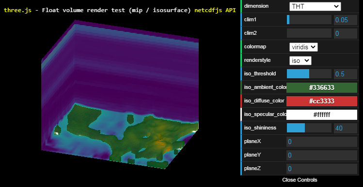

# netcdf-three
ThreeJS visualisation of NetCDF datasets
Due to the typically large sizes of netcdf files, this library exposes a promise-based interface to retrieve and decode the dataset header, and then only download on-demand the file parts that correspond to the dimensions/volumes to be visualized.
Once the volume is downloaded, it can be uploaded on the GPU as a 3D texture and used in one of the 2 provided materials with configurable 1D colormaps.
- A sampling material that achieves a simple 3D lookup
- A volume rendering material that shows either an isosurface or the maximum value reached by each viewing ray through the volume.

This library is built on top of :
- [netcdf.js](https://github.com/cheminfo/netcdfjs) : to read netcdf v3 files
- [three.js](https://github.com/mrdoob/three.js) : for rendering using WebGL

The [demo](https://www.umr-lastig.fr/netcdf-three/) provided by [index.html](index.html) further uses :
- [WebGL.js](https://github.com/mrdoob/three.js/blob/master/examples/js/WebGL.js) : for checking WebGL support 
- [OrbitControls.js](https://github.com/mrdoob/three.js/blob/master/examples/js/controls/OrbitControls.js) : for navigation
- [dat.gui](https://github.com/dataarts/dat.gui) : to provide a simple user interface

# Limitations
- Not all netcdf files are supported, as netcdfjs only supports v3 files. Other file formats have to be converted first. An extension could be to depend on jsfive, which claims to provide read support for hdf5 files, which is the format of more recent netcdf files (v4), so as to support both v3 files using netcdfjs and v4 files using jsfive.
- Rendering parameters are not tuned automatically to adapt to the volume displayed.
- This library would benefit from structuring it as a js dependency to be used in larger projects (webpack...)
- 'record' variables are not fully supported
- Only 'float' and 'double' variables have been tested